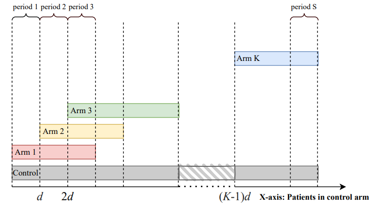

# NCC: Simulation and analysis of platform trials with non-concurrent controls 

```{r setup, include=FALSE}
library(knitr)
opts_chunk$set(echo = TRUE,
               message = FALSE,
               error = FALSE,
               warning = FALSE,
               comment = "",
               fig.align = "center",
               out.width = "70%")

source("R/datasim_cont.R")
source("R/linear_trend.R")
source("R/get_ss_matrix.R")
```

`NCC` package allows users to simulate platform trials and to compare arms using non-concurrent control data.

This package contains the following functions:

-   `datasim_bin()` simulates data with binary outcomes
-   `datasim_cont()` simulates data with continuous outcomes
-   `get_ss_matrix()` computes sample sizes per arm and period
-   `linear_trend()` is the linear time trend function, used to generate the trend for each patient
-   `sw_trend()` is the step-wise time trend function, used generate the trend for each patient
-   `fixmodel_bin()` performs analysis using regression model for binary data
-   `fixmodel_cont()` performs analysis using regression model for continuous data
-   `MAPprior_bin()` performs analysis using the MAP prior approach for binary data
-   `poolmodel_bin()` performs pooled analysis for binary data
-   `poolmodel_cont()` performs pooled analysis for continuous data
-   `sepmodel_bin()` performs separate analysis for binary data
-   `sepmodel_cont()` performs separate analysis for continuous data
-   `timemachine_bin()` performs analysis using the timemachine approach for binary data
-   `timemachine_cont()` performs analysis using the timemachine approach for continuous data

For a more detailed description of the functions, see the vignettes in the R-package website (<https://pavlakrotka.github.io/NCC/>).

### Design overview

We consider a platform trial evaluating the efficacy of $K$ treatment arms compared to a shared control. We assume that treatment arms enter the platform trial sequentially. In particular, we consider a trial starting with one initial treatment arm, where a new arm is added after every $d=(d_1,...,d_K)$ patients have been recruited to the trial (with $d_1=0$).

We divide the duration of the trial into $S$ periods, where the periods are the time intervals bounded by times at which a treatment arm either enters or leaves the platform.

The below figure illustrates the considered trial design.

```{r, echo=FALSE}

```

## Installation

```{r, message=FALSE, warning=FALSE, results=FALSE, eval=FALSE}
# install.packages("devtools") 
devtools::install_github("pavlakrotka/NCC", build_vignettes = TRUE)
```

## Documentation

```{r, message=FALSE, warning=FALSE, results=FALSE, eval=FALSE}
browseVignettes("NCC")
```

## References

[1] Bofill Roig, Marta, et al. *"On model-based time trend adjustments in platform trials with non-concurrent controls."* arXiv preprint [arXiv:2112.06574](https://arxiv.org/abs/2112.06574) (2021).

[2] Lee, Kim May, and James Wason. *"Including non-concurrent control patients in the analysis of platform trials: is it worth it?."* BMC medical research methodology 20.1 (2020): 1-12.

------------------------------------------------------------------------

**Funding**

[EU-PEARL](https://eu-pearl.eu/) (EU Patient-cEntric clinicAl tRial pLatforms) project has received funding from the Innovative Medicines Initiative (IMI) 2 Joint Undertaking (JU) under grant agreement No 853966. This Joint Undertaking receives support from the European Union’s Horizon 2020 research and innovation programme and EFPIA andChildren’s Tumor Foundation, Global Alliance for TB Drug Development non-profit organisation, Spring works Therapeutics Inc. This publication reflects the authors’ views. Neither IMI nor the European Union, EFPIA, or any Associated Partners are responsible for any use that may be made of the information contained herein.
