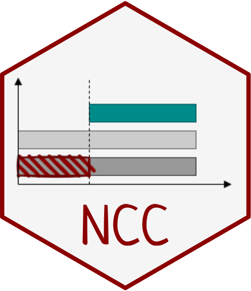
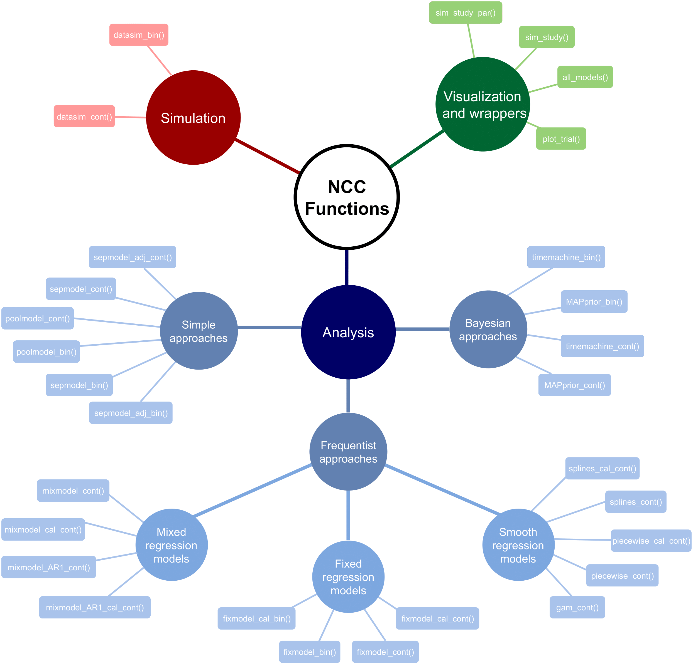

# NCC: Simulation and analysis of platform trials with non-concurrent controls 

`NCC` package allows users to simulate platform trials and to compare
arms using non-concurrent control data.

## Design overview

We consider a platform trial evaluating the efficacy of

treatment arms compared to a shared control. We assume that treatment
arms enter the platform trial sequentially. In particular, we consider a
trial starting with at least one initial treatment arm, where a new arm
is added after every
")
patients have been recruited to the trial (with
).

We divide the duration of the trial into

periods, where the periods are the time intervals bounded by times at
which a treatment arm either enters or leaves the platform.

The below figure illustrates the considered trial design.


## Functions

This package contains the following functions:

### Data generation

#### Main functions for data generation

-   `datasim_bin()` simulates data with binary outcomes
-   `datasim_cont()` simulates data with continuous outcomes

#### Auxiliary functions for data generation

-   `get_ss_matrix()` computes sample sizes per arm and period
-   `linear_trend()` is the linear time trend function, used to generate
    the trend for each patient
-   `sw_trend()` is the step-wise time trend function, used generate the
    trend for each patient
-   `inv_u_trend()` is the inverted-u time trend function, used generate
    the trend for each patient
-   `seasonal_trend()` is the seasonal time trend function, used
    generate the trend for each patient

### Data analysis

#### Treatment-control comparisons for binary endpoints

##### Frequentist approaches

-   `fixmodel_bin()` performs analysis using a regression model
    adjusting for periods
-   `fixmodel_cal_bin()` performs analysis using a regression model
    adjusting for calendar time
-   `poolmodel_bin()` performs pooled analysis
-   `sepmodel_bin()` performs separate analysis
-   `sepmodel_adj_bin()` performs separate analysis adjusting for
    periods

##### Bayesian approaches

-   `MAPprior_bin()` performs analysis using the MAP prior approach
-   `timemachine_bin()` performs analysis using the Time Machine
    approach

#### Treatment-control comparisons for continuous endpoints

##### Frequentist approaches

-   `fixmodel_cont()` performs analysis using a regression model
    adjusting for periods
-   `fixmodel_cal_cont()` performs analysis using a regression model
    adjusting for calendar time
-   `gam_cont()` performs analysis using generalized additive model
-   `mixmodel_cont()` performs analysis using a mixed model adjusting
    for periods as a random factor
-   `mixmodel_cal_cont()` performs analysis using a mixed model
    adjusting for calendar time as a random factor
-   `mixmodel_AR1_cont()` performs analysis using a mixed model
    adjusting for periods as a random factor with AR1 correlation
    structure
-   `mixmodel_AR1_cal_cont()` performs analysis using a mixed model
    adjusting for calendar time as a random factor with AR1 correlation
    structure
-   `piecewise_cont()` performs analysis using discontinuous piecewise
    polynomials per period
-   `piecewise_cal_cont()` performs analysis using discontinuous
    piecewise polynomials per calendar time
-   `poolmodel_cont()` performs pooled analysis
-   `sepmodel_cont()` performs separate analysis
-   `sepmodel_adj_cont()` performs separate analysis adjusting for
    periods
-   `splines_cont()` performs analysis using regression splines with
    knots placed according to periods
-   `splines_cal_cont()` performs analysis using regression splines with
    knots placed according to calendar times

##### Bayesian approaches

-   `MAPprior_cont()` performs analysis using the MAP prior approach
-   `timemachine_cont()` performs analysis using the Time Machine
    approach

### Running simulations

-   `all_models()` is an auxiliary wrapper function to analyze given
    dataset (treatment-control comparisons) with multiple models
-   `sim_study()` is a wrapper function to run a simulation study
    (treatment-control comparisons) for desired scenarios
-   `sim_study_par()` is a wrapper function to run a simulation study
    (treatment-control comparisons) for desired scenarios in parallel

### Visualization

-   `plot_trial()` visualizes the progress of a simulated trial

For a more detailed description of the functions, see the vignettes in
the R-package website (<https://pavlakrotka.github.io/NCC/>).

## Scheme of the package structure

The below figure illustrates the `NCC` package functions by
functionality.



## Installation

To install the latest version of the `NCC` package from Github, please
run the following code:

``` r
# install.packages("devtools") 
devtools::install_github("pavlakrotka/NCC", build_vignettes = TRUE)
```

## Documentation

Documentation of all functions as well as vignettes with further
description and examples can be found at the package website:
<https://pavlakrotka.github.io/NCC/>

## References

\[1\] Bofill Roig, M., Krotka, P., et al. [*“On model-based time trend
adjustments in platform trials with non-concurrent
controls.”*](https://bmcmedresmethodol.biomedcentral.com/articles/10.1186/s12874-022-01683-w)
BMC medical research methodology 22.1 (2022): 1-16.

\[2\] Lee, K. M., and Wason, J. [*“Including non-concurrent control
patients in the analysis of platform trials: is it worth
it?.”*](https://bmcmedresmethodol.biomedcentral.com/articles/10.1186/s12874-020-01043-6)
BMC medical research methodology 20.1 (2020): 1-12.

\[3\] Saville, B. R., Berry, D. A., et al. [*“The Bayesian Time Machine:
Accounting for Temporal Drift in Multi-arm Platform
Trials.”*](https://journals.sagepub.com/doi/full/10.1177/17407745221112013)
Clinical Trials 19.5 (2022): 490-501

------------------------------------------------------------------------

**Funding**

[EU-PEARL](https://eu-pearl.eu/) (EU Patient-cEntric clinicAl tRial
pLatforms) project has received funding from the Innovative Medicines
Initiative (IMI) 2 Joint Undertaking (JU) under grant agreement No
853966. This Joint Undertaking receives support from the European
Union’s Horizon 2020 research and innovation programme and EFPIA and
Children’s Tumor Foundation, Global Alliance for TB Drug Development
non-profit organisation, Spring works Therapeutics Inc. This publication
reflects the authors’ views. Neither IMI nor the European Union, EFPIA,
or any Associated Partners are responsible for any use that may be made
of the information contained herein.
